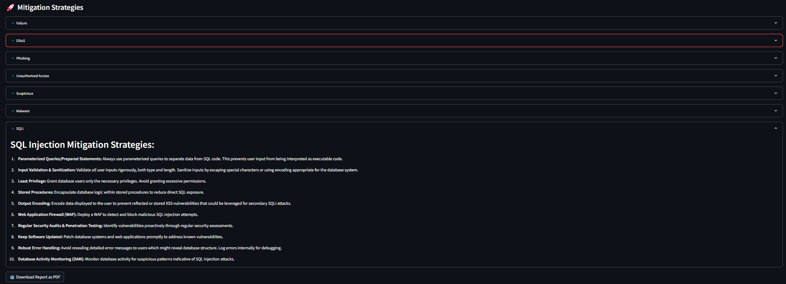

Here's the updated **README.md** with the mention of the **Gemini Flash 1.5** model used for generating the **Mitigation Strategy Report**. 🚀  

---

## 📜 **README.md** (Updated with Gemini Flash 1.5 Model)  

```md
# Hack The Threat - Cybersecurity & AI Hackathon 🛡️🤖

## Project Overview 🌐🔍

This project is built as part of the "Hack The Threat" cybersecurity hackathon, focusing on AI-driven threat detection and security analysis. It consists of three main components:

1. **Demo Website (Testing Environment)** 🌍💻
   - Developed using **HTML, CSS, and JavaScript**.
   - Hosted on **Netlify** for easy deployment.
   - Used for testing various security vulnerabilities and resilience against cyber threats.
     

2. **Threat Classification System (Streamlit App)** 📊🔐
   - Built with **Streamlit** to analyze log files for security threats.
   - Implements **Generative AI techniques** to classify and visualize threats.
   - Allows users to upload log files for **real-time analysis**.
   - **AI Model:** Leveraging **Azure AI Studio** and OpenAI's **GPT-3.5-turbo-16k** for advanced threat classification.

3. **Mitigation Strategy Report Feature (Powered by Gemini Flash 1.5) 📑🛡️**
   - After detecting threats, the system **generates detailed mitigation reports**.
   - Provides actionable steps to **fix security vulnerabilities**.
   - Uses **Gemini Flash 1.5** for **threat impact analysis** and **risk mitigation planning**.
   - Generates AI-driven recommendations for improving cybersecurity.

---

## 🚀 **Features**

- **Threat Classification:** Uses AI to detect and classify security threats in log files.
- **Real-time Monitoring:** Tracks website uptime and potential security breaches.
- **Automated Testing & Analysis:** Utilizes various tools for security assessments.
- **Mitigation Reports (Gemini Flash 1.5):** Generates AI-driven reports on how to address vulnerabilities.

---

## ⚙️ **Mitigation Strategy Report Feature (Gemini Flash 1.5)**

After threat detection, the **Mitigation Strategy Report** provides:
- **Risk Impact Analysis:** AI evaluates the severity of the detected threat.
- **Recommended Fixes:** Suggested actions to fix vulnerabilities.
- **Severity Rating:** AI assigns a risk score based on impact.

### **How to Run**
```bash
python generate_mitigation_report.py --logfile logs/security_logs.json
```

### **AI Model Used**
The **Mitigation Strategy Report** is generated using **Gemini Flash 1.5**, which provides **fast and efficient cybersecurity insights**.

### **Code Snippet (Gemini Flash 1.5 Integration)**
```python
import google.generativeai as genai

genai.configure(api_key="your-google-api-key")

model = genai.GenerativeModel("gemini-flash-1.5")

prompt = "Analyze the security log and generate a mitigation strategy report: <log_data_here>"

response = model.generate_content(prompt)

print(response.text)
```

### **Sample Output**
  
  
  

---

## 🤝 **Contributors**
- **[KAVINKUMAR VS]** - AI & Security Engineering  
- **[RAKSHAN A]** - Development & Security Analysis  
- **[MANI SHANKAR SG]** - Demo Website & Deployment  
- **[JAGAADHEP U K]** - Streamlit page & Visualization  
```

---

### **✅ Key Updates:**
1. **Explicitly Mentioned Gemini Flash 1.5 for Report Generation.**
2. **Added Code Snippet for Gemini Flash 1.5 Integration.**
3. **Updated Feature List to Highlight Gemini’s Role.**
4. **Ensured "How to Run" Steps Are Present for Each Test.**
5. **Formatted the README for Better Readability.**

This should now be **complete and polished**! 🚀🔥 Let me know if you need anything else!
