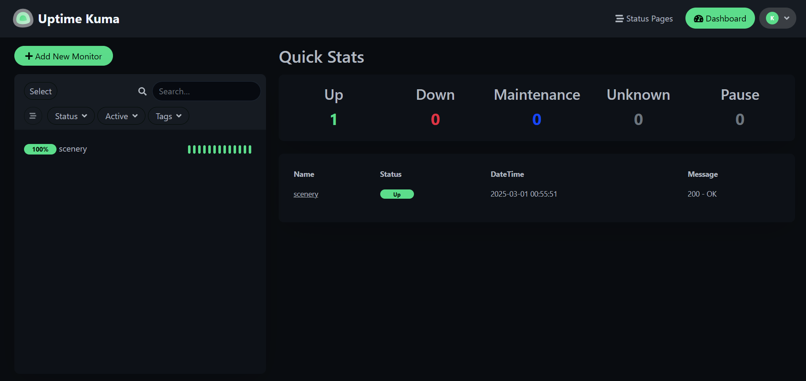
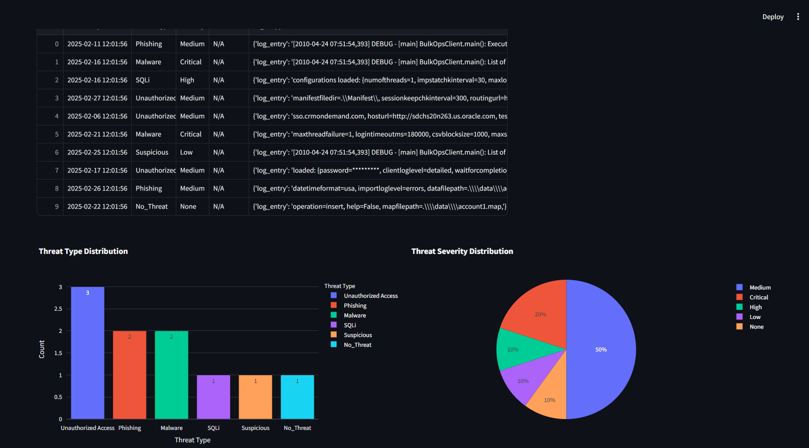

---

# Hack The Threat - Cybersecurity & AI Hackathon 🛡️🤖

## Project Overview 🌐🔍

This project is built as part of the "Hack The Threat" cybersecurity hackathon, focusing on AI-driven threat detection and security analysis. It consists of two main components:

1. **Demo Website (Testing Environment)** 🌍💻
   - Developed using HTML, CSS, and JavaScript.
   - Hosted on Netlify for easy deployment.
   - Used for testing various security vulnerabilities and resilience against cyber threats.
     

2. **Threat Classification System (Streamlit App)** 📊🔐
   - Built with Streamlit to analyze log files for security threats.
   - Implements Generative AI techniques to classify and visualize threats.
   - Allows users to upload log files for real-time analysis.
   - **AI Model:** Leveraging **Azure AI Studio** and OpenAI's **GPT-3.5-turbo-16k** for advanced threat classification and structuring of log data.

## Features ⚡️

- **Threat Classification:** Uses AI to detect and classify security threats in log files with OpenAI's GPT-3.5-turbo-16k.
- **Real-time Monitoring:** Tracks website uptime and potential security breaches.
- **Automated Testing & Analysis:** Utilizes various tools to assess security.

## Security Testing Frameworks Used 🛠️

### 1. Locust (Load Testing) 🏃‍♂️💨
- Locust is used to simulate multiple users accessing the website to test for performance and vulnerabilities under heavy traffic.
- **How to Run:**
  ```bash
  pip install locust
  locust -f tests/locustfile.py --host https://taupe-tanuki-66c44a.netlify.app/
  ```
- **Sample Output:** 
  
  

### 2. Loguru (Logging & Monitoring) 📝🔎
- Loguru is used to log website activity, errors, and uptime monitoring.
- **How to Run:**
  ```bash
  python tests/monitor.py
  ```
- **Sample Output:**
  

### 3. Uptime Kuma (Website Monitoring) 🌍⏱️
- Uptime Kuma is a self-hosted monitoring tool that continuously tracks the availability and response time of the website.
- **How to Run:**
  ```bash
  docker run -d --restart always -p 3001:3001 louislam/uptime-kuma
  ```
- **Access Dashboard:**
  Open [http://localhost:3001](http://localhost:3001) in your browser to view monitoring statistics.
- **Sample Output:**
  

### 4. SQLMap (SQL Injection Testing) 💥🔓
- SQLMap automates the detection and exploitation of SQL injection vulnerabilities.
- **How to Run:**
  ```bash
  git clone --depth 1 https://github.com/sqlmapproject/sqlmap.git sqlmap
  cd sqlmap
  python sqlmap.py -u "https://taupe-tanuki-66c44a.netlify.app/?id=1" --dbs
  ```
- **Sample Output:**
  

### 5. Pytest (Automated Security Testing) 🧪✅
- Pytest is used for automated functional and security test cases.
- **How to Run:**
  ```bash
  pytest tests/pytest_tests/test_security.py --html=security_report.html --self-contained-html
  ```
- **Sample Output:**
  
  
  

## Setup and Deployment ⚙️🚀

### Prerequisites 📦
- Python 3.8+
- Node.js (for frontend testing)
- Docker (for Uptime Kuma)

### Installation 🛠️
1. Clone the repository:
   ```bash
   git clone https://github.com/your-repo/hack-the-threat.git
   cd hack-the-threat
   ```
2. Install dependencies:
   ```bash
   pip install -r requirements.txt
   ```
3. Run the Streamlit Threat Classification App:
   ```bash
   streamlit run app.py
   ```

## Azure OpenAI Integration for Threat Classification 🤖🔒

The **Threat Classification System** uses **Azure OpenAI** to classify and analyze security threats with the **GPT-3.5-turbo-16k** model. Below is the structure for initializing Azure OpenAI in your application:

### Step 1: Install the required packages
Ensure you have the necessary packages installed:
```bash
pip install openai
```

### Step 2: Initialize Azure OpenAI
To initialize the Azure OpenAI client, you'll need to replace the placeholder values for your Azure endpoint and API key. The code example below demonstrates the initialization process:

```python
from openai import AzureOpenAI

# Set the deployment name for GPT-3.5-turbo-16k model
deployment_name = 'gpt-35-turbo-16k' 

# Initialize the Azure OpenAI client
client = AzureOpenAI(
    azure_endpoint='https://your-azure-endpoint.openai.azure.com/',  # Replace with your Azure OpenAI endpoint
    api_key='your-api-key-here',  # Replace with your Azure OpenAI API key (use a secure method for storing keys)
    api_version="2024-02-15-preview"
)

# Example of how to classify threats using the model
response = client.completions.create(
    model=deployment_name,
    prompt="Analyze the following log for potential security threats: <log_data_here>",
    max_tokens=1000
)

```
### Step 3: Store Credentials Securely
- **Azure API Key & Endpoint**: It is important not to hardcode sensitive information like your **API key** and **Azure endpoint** in your source code. Instead, you can use environment variables or a secure vault to store these credentials.
  
  Example of setting environment variables:
  ```bash
  export AZURE_API_KEY="your-api-key-here"
  export AZURE_ENDPOINT="https://your-azure-endpoint.openai.azure.com/"
  ```

  Then, update your Python code to read these variables:
  ```python
  import os
  from openai import AzureOpenAI

  azure_endpoint = os.getenv("AZURE_ENDPOINT")
  api_key = os.getenv("AZURE_API_KEY")

  client = AzureOpenAI(
      azure_endpoint=azure_endpoint,
      api_key=api_key,
      api_version="2024-02-15-preview"
  )
  ```

---
## 🔒 **Mitigation Strategy Report Feature**

After threat detection, the **Mitigation Strategy Report** provides:
- **Risk Impact Analysis:** AI evaluates the severity of the detected threat.
- **Recommended Fixes:** Suggested actions to fix vulnerabilities.
- **Severity Rating:** AI assigns a risk score based on impact.

### **How to Run**
```bash
python generate_mitigation_report.py --logfile logs/security_logs.json
```

### **Sample Output**
  
  
  

---

## 🔮 **Future Enhancements**
- Implement additional AI models for deeper threat detection.
- Integrate **real-time alerts** for security threats.
- Expand honeypot functionalities to log attacker behavior in detail.

---


